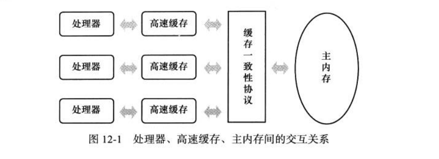
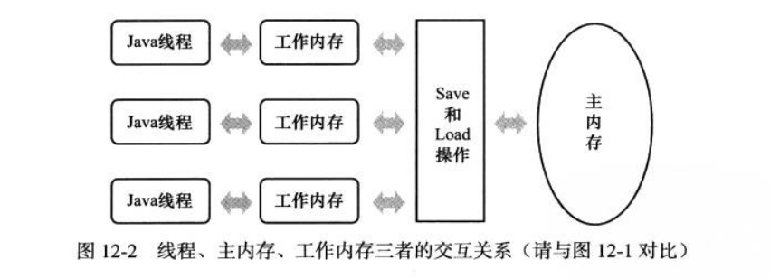
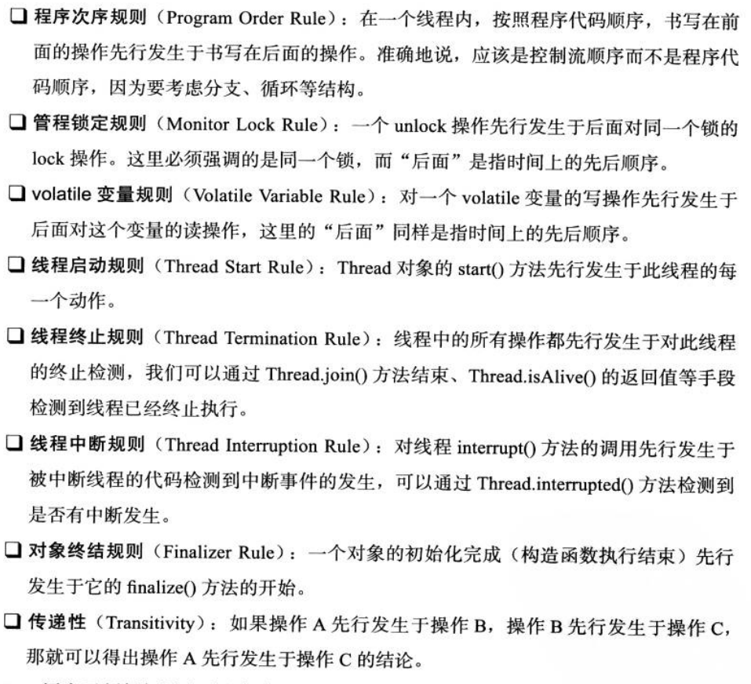
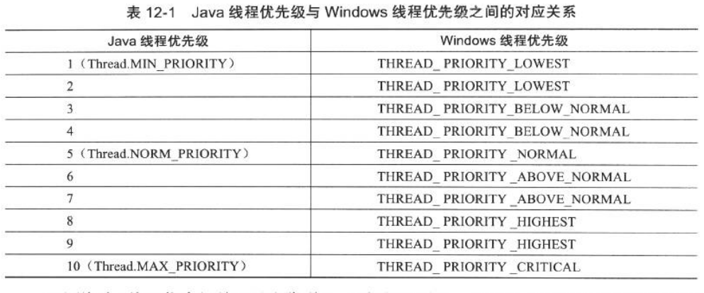
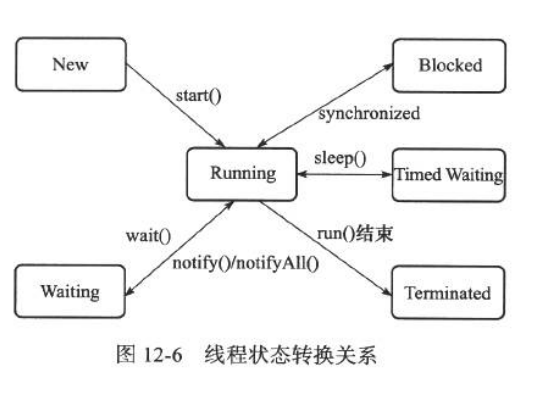

# 12 高效并发----Java内存模型与线程

计算机运算速度>>>>存储与通信子系统速度，大量时间花费在磁盘I/O、网络通信、数据库访问上。为了防止资源浪费在等待其他资源的状态，需要让计算机同时处理多项任务。一个服务器对应多个客户端的并发应用场景，用每秒事物数( Transaction Per Second, TPS )衡量服务性能的高低好坏。

#### Java内存模型 Java Memory Model，JMM

JMM，java定义的用来屏蔽各种硬件和操作系统的内存访问差异，以实现让Java程序在各种平台下都达到一致的内存访问效果。

##### 主内存与工作内存

Java内存模型主要的目标时定义程序中各个变量的访问规则，即在虚拟机中将**变量**存储到内存和从内存中取出来这样的底层细节。**变量**包括实例字段、静态字段、构成数组对象的元素，不包括局部变量和方法参数( 线程私有，不会被共享 )。

java内存模型规定了所有变量都存储在主内存，与物理机主内存对应

每条线程的工作内存，保存了被该线程使用变量的主内存副本拷贝，线程对变量的操作( 读取，赋值 ) 都必须在工作内存进行,其对应于处理器高速缓存，不能直接主内存的变量。不同线程之间也不能直接访问对方的工作内存中的变量，线程间变量值的传递需要通过主内存完成.

通俗的讲主内存对应于java堆中的对象实例数据部分，工作内存对应于虚拟机栈中的部分区域。

##### 内存之间的交互操作

即一个变量如何从主内存拷贝到工作内存、如何从工作内存同步回主内存的实现细节

定义了相关的8中原子性操作：

lock(锁定)：作用于**主内存**的变量，把变量表示为一条线程独占的状态。

unlock(解锁)：作用于**主内存**的变量，把处于锁定状态的变量释放出来，释放后的变量才可以被其他线程锁定。

read(读取)：作用于**主内存**的变量，把一个变量的值从主内存传输到线程的工作内存，以便随后的load动作使用。

load(载入)：作用于**工作内存**的变量，他把read操作从主内存中得到的变量值放入工作内存的变量副本中

use(使用)：作用于**工作内存**的变量，他把工作内存一个变量的值传给执行引擎，每当虚拟机遇到一个需要使用变量值的字节码指令时将会执行这个操作。

assign(赋值)：作用于**工作内存**的变量，它把一个从执行引擎接收到的值赋给工作内存的变量，每当虚拟机遇到一个给变量赋值的字节码指令时执行这个操作。

store(存储)：作用于**工作内存**的变量，它把工作内存的一个变量的值传送到主内存中，以便随后的write操作是使用。

write(写入)：作用于**主内存**的变量，它把store操作从内存中得到的变量值放入主内存的变量中。

##### 对于volatile变量的特殊规则

[什么是原子操作](https://www.jianshu.com/p/4e6d4da1434a)

两种特性：

1. 保证此变量对所有线程的可见性，不保证**原子性**。即当一条线程修改了这个变量值，新值对于其他线程来说是可以立即得知的。对于普通变量做不到这一点，普通变量的值线程间传递需要通过主内存来完成。不满足下面的条件任然需要加锁：

   1）运算结果并不依赖变量的当前值，或者能够确保只有**单一的线程**修改变量的值。

   2）变量不需要与其他的状态变量共同参与不变约束

2. 禁止指令重排

   使用双索检测完成单例模式设计

volatile对变量的读取几乎没有影响，但是写会慢一点。（需要在本地代码中插入内存屏障，防止指令重排），但是volatile的开销任然比锁低

##### long、double变量的特殊规则

java内存模型允许虚拟机将没有被volatile修饰的64位数据的读写操作划分为两次32位操作，也就是可以不保证64位数据的load、read、store、write四个操作的原子性，这就是long和double的非原子性协定。如果多线程共享一个没有被volatile修饰的64位变量，同时对变量读写操作，有可能读取到未修改完的半个变量。目前这种读取到半个变量的情况不会再各种平台的商用虚拟机中看到，商用虚拟机基本都把64位数据读写操作作为原子性看待，因此一般用到long和double不需要加volatile。

----

----

#### 原子性、可见性、有序性

原子性：java内存模型保证原子性的操作包括read、load、assign、use、store、write，可以认为基本数据类型的访问都具备原子性，例外就是long、double，synchronized包裹的代码块也具有原子性

可见性：可见性是指当一个线程修改了共享变量的值，其他线程能够立即得知这个修改。volatile保证了新的值能够立即同步会主内存，每次使用立即从主内存刷新。而普通变量做不到这一点。除了volatile关键字，synchronized（有现成unlock变量前，必须把当前线程中该变量同步回主内存）和final也能实现可见性。

有序性：从本线程内观察，所有操作都是有序的；如果从另一个线程中观察本线程，左右操作都是无序的。前半句指线程内表现为串行语义，后半句指指令重排序和工作内存与主内存同步延迟。Java中提供volatile和synchronzied 保证线程之间操作的有序性。

#### 先行发生原则----判定是否存在线程冲突

-------

#### java线程

##### 1 线程实现

线程是比进程更轻量级的调度单位，线程的引入，可以把一个进程的资源分配和执行调度分开，各个线程既可以共享进程资源（内存地址、文件I/O等），又可以独立调度（线程是CPU最小的调度单位）。

实现线程的3中方式：使用内核线程实现、使用用户线程实现、使用用户加轻量级线程混合实现。

##### 2 java线程调度

线程调度是指为线程分配处理器使用权的过程，主要为分两种，1）协同式线程调度；2）抢占式线程调度（java）

java使用抢占式调度，线程调度是系统自动完成，可以用Thread.yield()让出处理器时间，但是方法可以获取处理器时间。可以**建议**系统给某些线程多分配一点执行时间，可以通过分配优先级的方式实现。java语言线程优先级一共10个级别，优先级越高，线程越容易被系统选择执行，默认是5。不过java线程是通过映射到原生线程上实现的，线程调度还是取决于操作系统，不一定与java线程优先级一一对应。

**由于这种不对应的关系，不同平台的不同优先级实际会变得相同，所以不能太依赖优先级。**

----

#### 线程状态转换

java语言定义了5种线程状态，在任意一个时间点，一个县城只能有且只有其中一种状态，这5种状态分别为：

**新建New**：创建后尚未启动的线程处于这种状态

**运行Runnable** ：Runnable包括了操作系统线程状态的Running和Ready，也就是处于此状态的线程可能正在执行，也有可能正在等待着CPU为它分配执行时间。

**无限期等待Waiting**：处于这种状态的线程不会被分配CPU时间，他们要等待被其他线程显示地唤醒。以下方法会让线程陷入无限期等待状态：

* 没有设置Timeout参数的Object.wait()方法
* 没有设置Timeout参数的Thread.join()方法
* LockSupport.park()方法

**限期等待 Timed Waiting** ：这种状态的新城也不会被分配CPU执行时间，不过无需等待被其他线程显示地唤醒，在一定时间之后他们会由系统自动唤醒。以下方法会让线程进去限期等待：

* Thread.sleep()
* 设置Timeout参数的Object.wait()方法
* 设置Timeout参数的Thread.join()方法
* LockSupport.parkNano()方法
* LockSupport.parkUntil()方法

**阻塞 Blocked** ： 线程被阻塞了，“阻塞状态”与“等待状态”的区别是：“阻塞状态”等待者获取到一个排他锁，这个时间在另外一个线程放弃这个锁时候发生；而“等待状态”则是等待一段时间，或者唤醒动作发生。在程序等待进入同步区域的时候，线程进入这种状态。

**结束 Terminated**：已终止线程的线程状态，线程已结束执行。

[sleep()、join()、yield()、wait()、notify()、notifyAll()](https://dylanxu.iteye.com/blog/1322066/)

[wait和notify的理解与使用](https://www.cnblogs.com/eer123/p/7880789.html)

[synchronized用法](https://www.jianshu.com/p/d53bf830fa09)

[线程的状态转换以及基本操作](https://www.jianshu.com/p/f65ea68a4a7f)

