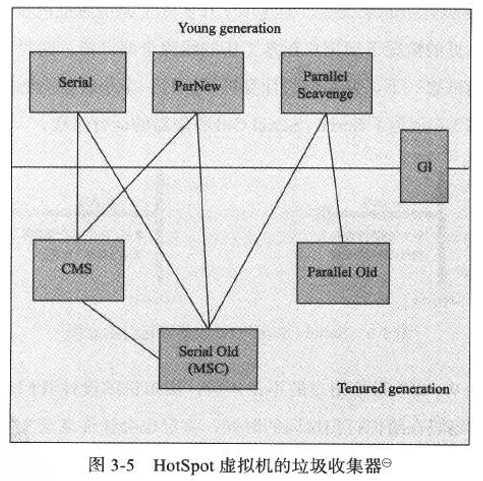
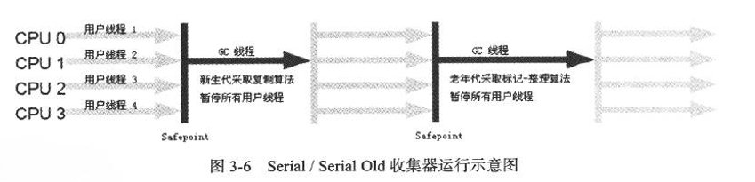
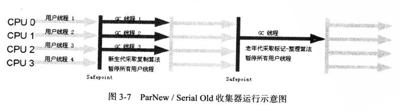
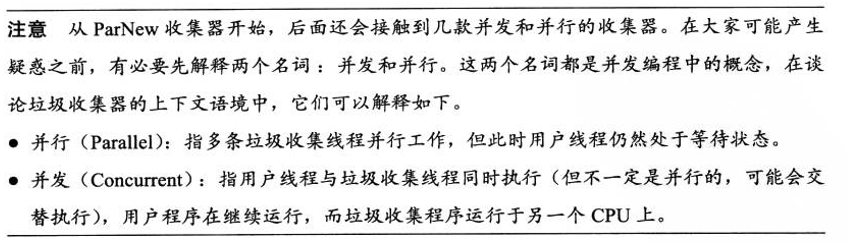
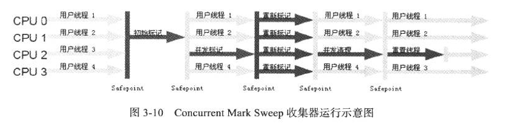
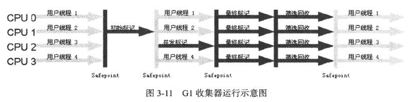
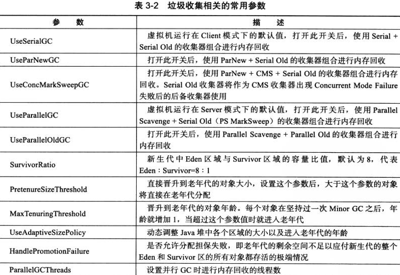
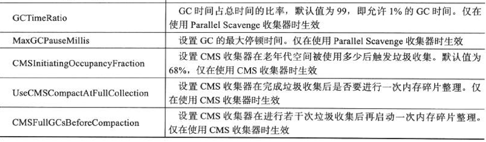
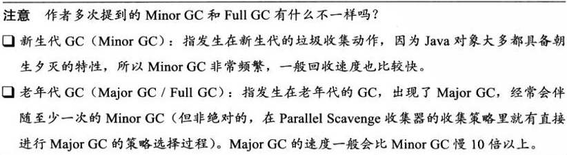

# 垃圾收集与内存分配策略

垃圾收集( Garbage Collection, GC )

 ### 1.确认对象“已死“？

#### 1)引用计数算法

给对象添加引用技术器，每当有一个地方引用它就加1，引用失效，计数器值减1，计数器为0的对象就是不可能在被使用的。python等语言使用了引用计数算法，但是java没有使用，原因是无法解决对象间循环引用的问题。

#### 2)可达性分析算法

主流商用程序语言**c#，java**都是用可达性分析算法判断对象是否存活。GC Roots作为起始点，从该节点向下搜索的路径就是引用链**Reference Chain** ，当一个对象没有任何引用链与GC Roots相连的话，这个对象就是不可用的。

 Java中可作为GC Roots的对象：ii)虚拟机栈中**本地变量表**中的引用对象；ii)方法区中类静态属性引用的对象；

iii)方法区中常量引用的对象；iv)本地方法栈中JNI( Native 方法 )引用的对象。

Java中对象不止有引用和被引用两种状态，扩充为四种：

​	强引用：Object obj = new Object() ,重要强引用还在永远不会被垃圾收集器回收 

​	软引用：描述的是此引用的对象还有用，但不是必须，软引用关联的对象在系统将要发生内存溢出异常前，会	把这些对象放入回收列表进行二次回收，如果这次回收还没有足够内存，才会抛出内存溢出异常。虚拟机使用	SoftReference类实现软引用。

​	弱引用：强度比弱引用更弱，被关联的对象只能生存到下一次垃圾收集发生之前。垃圾收集器工作时不管内存	是否足够都会回收被弱引用关联的对象。WeakReference类实现

​	虚引用：对象的虚引用完全不对其生存时间构成影响，无法通过虚引用获得一个对象实例。虚引用作用时在对	象被收集器回收时收到一个系统通知。PhantomReference类实现

​	对象不可达也不一定时必须死亡，一个对象死亡需要经过两次标记。第一次表示时被发现没有与GC Roots的引	用链之后，第二次表示是筛选对象有没有必要执行finalize()方法。[没有必要就是finalize方法没有重写后者已经	被执行过]

**回收方法区**条件：1.该类所有实例已经被回收，堆中无实例

​                               2.加载该类的ClassLoader已经被回收

​                               3.该类对应的java.lang.Class对象没有在任何地方被调用，无法在任何地方通过反射访问该类的                                                                                          								方法

----

#### 垃圾垃圾收集算法

**标记-清除算法** ：是最基础的收集算法，分为标记和收集两个阶段。缺点是两个阶段的效率都不高，二是需要连续空间不足会提前触发二次收集。

**复制算法** ：将内存分为两块，一次只用一块，一块内存用完了就把还活着的对象复制到另一块上，清理掉之前的一块。优势是不用考虑内存碎片，通过移动堆顶指针，按准许分配内存，简单高效。缺点是内存分为两半代价高。现代商用虚拟机采用这种方式回收**新生代** ，但内存并不是1:1划分。分为一块大的Eden空间和两块小的Survivor空间。每次只使用Eden和一块Survivor，回收时将存活的对象复制到另一块Survivor空间，清理掉之前的Eden和使用过的Survivor空间，HotSpot默认Eden和Survivor大小为8:1，每次只有10%的空间浪费。当存活对象超过10%时，Survivor空间不够，需要借助其他内存（Eden）进行分配担保。

**标记-整理算法** ：复制算法再对象存活率较高时，会进行较多复制操作，效率变低，如果不想浪费50%的空间就需要额外的空间进行分配担保，所以老年代一般不能直接选用这种算法。先标记再让存活对象往一端移动，在直接清理掉端边界以外的内存。

**分代收集算法** ：当前商用虚拟机都采用“分带收集”（Generational Collection）算法。思想是根据对象存活周期将内存划分为几块，一般把堆分为新生代或者老生代，根据各代特点采用对合适的收集算法。

****

#### HotSpot算法实现

准确式GC：Exact VM 使用准确式内存管理（Exact Memory Management），即虚拟机可以知道内存某个具体位置的数据的具体类型。

HotSpot使用OopMap来记录那些地方存放的是对象引用。在类加载完成的时候，HotSpot就把对象内什么偏移量上是什么类型的数据计算出来，JIT编译过程中也会在特定的位置记录下栈和寄存器中哪些位置是引用。这样GC Roots节点找到引用链就可以直接从OopMap中获取。

安全点：HotSpot中不是每条指令都会生成OopMap，只有在特定位置才记录信息，这就是安全点，停顿下来完成GC。GC发生时如何让所有线程都跑到最近的安全点再停顿下来，有两种方式：抢先式中断、主动式中断。

安全区域：程序在执行时使用安全点来进入GC。当程序处于不执行的状态，如线程的Sleep和Blocked，就不太可能进入安全点，这时候使用一个叫安全区域的方式。安全区域是一个代码段中引用关系不会发生变化，在这个区域中任意地方开始GC都是安全的。线程执行到安全区域的代码时，首先会标识自己进入了SafeRegion，这段时间内JVM发起GC时，会忽略SafeRegion状态的线程。线程离开安全区域时需要确认是否已经完成了根点枚举或者整个GC过程，如果完成了就继续执行，否则需要等待直到接收到可以安全离开安全区域的信号。

----

#### 垃圾收集器 ---- 内存回收算法的具体实现

连线表示可以搭配使用，主要理解CMS（Concurrent Mark Sweep）和G1（Garbage First）

1. Serial 收集器

​	Serial收集器时单线程的收集器，在垃圾收集时会暂停其他工作线程直到结束。虽然Serial很老，但依然是Client模式下默认的新生代收集器。优势在于：简单高效，单CPU环境下没有线程交互开销。用户桌面应用场景中，分配给虚拟机管理的内存小，停顿在几十毫秒到一百多毫秒，完全可以接受。

2. ParNew收集器

   ParNew收集器时Serial的多线程版本，除了使用多线程垃圾收集之外，其余都与Serial收集器完全一样。

 	许多Server模式下虚拟机首选ParNew为新生代收集器，主要原因时除了Serial之外，只有ParNew能与CMS配合工作。

3. Parallel Scavenge

   Parallel Scavenge也是个新生代收集器，使复制算法，是并行的多线程收集器。

   Parallel Scavenge与其他收集器关注的重点不同，CMS等收集器关注的是尽量缩短垃圾收集时用户线程的停顿时间，Parallel Scavenge目的是达到一个可控制的吞吐量。吞吐量是CPU运行用户代码的时间与cpu消耗的时间比值，吞吐量=运行用户代码时间/（运行用户代码时间+垃圾收集时间）。停顿时间越短就越适合需要与用户交互的程序，高吞吐量则可以高效率的利用CPU时间，尽快完成运算任务，适合后台运算不需要太多交互的任务。
   
   Parallel Scavenge收集器的两个参数控制吞吐量：
   
   最大垃圾收集停顿时间 -XX:MaxGcPauseMillis
   
   吞吐量大小 -ZZ:GCtimeRatio
   
   Parallel Scavenge 自适应策略  -XX:UseAdaptiveSizePolicy
   
4. Serial Old收集器 标记整理

   Serial收集器的老年代版本，单线程收集器主要给Client模式下的虚拟机使用。在server模式下有两大用途，一是配合Parallel Scavenge搭配使用；二是CMS发生Consurrent Mode Failure的后备方案

5. Parallel old收集器 标记整理

   Parallel Scavenge收集器的老年代版本，在注重吞吐量以及cpu资源敏感的场合优先考虑Parallel Scavenge加Parallel Old

   

6. CMS(并发标记清理)收集器：

   HotSpot虚拟机中第一款真正意义上并发的收集器，第一次让垃圾收集线程与用户线程同时工作。

   CMS目标是获取最短回收停顿时间，适合Java应用集中的互联网站和B/S系统服务器上，较为注重服务的响应速度。

   CMS分为四个步骤：

   * 初始标记 CMS initial mark，标记GC Roots能直接关联到的对象，停顿
   * 并发标记 CMS concurrentmark，进行GC Roots Tracing的过程
   * 重新标记 CMS remark，修正并发标记期间用户程序继续运行而导致标记变动的那部分对象的记录。停顿
   * 并发清除 CMS concurrent sweep， 并发标记和并发清除可以和用户线程一起工作。

​	缺点：一是对CPU敏感，二是无法处理浮动垃圾，三是使用标记-清除算法，空间中碎片过多

7. G1收集器

   面向服务端应用的垃圾收集器，替换CMS，与其他GC收集器相比有如下特点：

   - 并行与并发：G1能够利用多核、多CPU的硬件优势，使用多个CPU来缩短停顿时间
   - 分代收集：能独立管理整个GC堆，采用不同的方式处理新创建的对象和已经存在的对象、经历过多次GC的旧对象
   - 空间整合：与CMS使用标记-清理算法不同，G1整体上基于标记-清理，局部时基于复制算法实现，意味着G1运行期间不会产生碎片，不会因为分配大对象内存不够提前触发GC 
   - 可预测的停顿：与CMS的另一大优势，降低停顿时CMS和G1的共同点，此外G1海恩那个建立可预测停顿时间模型，能让使用者明确指定在一个长度为M毫秒内的时间片段内，消耗在垃圾收集上的时间不超过N毫秒，这几乎是实时Java的垃圾收集器的特征。

   使用G1收集器时，java堆的内存布局和其他收集器有很大差别，他将整个java堆划分为多个大小相等的独立区域（Region），虽然还保留新生代和老生代的概念，但是新生代和老生代不再是物理隔离的，有一部分是Region的集合。

   G1之所以能建立可预测的停顿时间模型，是因为他可以有计划的避免在整个Java堆中进行全区域的垃圾搜集。G2追踪Region中垃圾堆积的价值大小，后台维护宇哥优先列表，每次根据允许的收集时间，优先会有价值最大的Region（Garbage-First的由来）。这种使用Region划分内存空间以及有优先级的区域会有方式，保证了G1收集器在有限时间内尽可能提高收集效率。

   G1收集器以及其他收集器的新生代与老年代之间的对象引用，都是使用Remembered Set来避免全堆扫描。G1中每个Region都有个与之对应的Remembered Set。虚拟机发现程序堆Reference类型数据写操作时，会触发Write Barrier暂时中断写操作，检查Reference引用的对象是否处于不同的Region之中（分代的例子中就是检查是否老年代中的对象引用了新生代中的对象），如果是就通过CardTable把相关引用信息记录到被引用对象所属的Region的Remembered Set中。当内存回收时，Gc根节点枚举范围中加入Remembered Set即可保证不对全堆扫描也不会有遗漏.

   不计算维护Remembered Set操作，G1收集器运作大致可划分为一下几个步骤：

   - 初始标记  Iinitial marking, 仅仅标记GC Roots能直接关联到的对象，并且修改TAMS（Next Top at Mark Start）的值，让下一阶段用户程序并发运行，能在正确可用的Region中创建对象，这阶段需要停顿线程，耗时短。
   - 并发标记  Concurrent Marking， 从Gc Root开始对堆中对象进行可达性分析， 找出存活的对象，耗时长，但可以和用户进程并发执行。
   - 最终标记  Final Marking， 为了修正并发标记期间用户程序继续运行而导致标记产生变化的那一部分记录，虚拟机将这段时间对象变化记录在线程Remembered Set Logs中，最终标记阶段需要把Remembered Set Logs的数据合并到Remembered Set中。需要停顿线程，但可并行执行。
   - 筛选回收  Live Data Counting and Evacuation ， 对各个Region的回收价值和成本排序，根据用户期望的GC从停顿时间指定回收计划。这个阶段可以做到和用户程序一起并发执行，因为值回收一部分Region，时间是用户控制的，停顿用户线程将大幅度提高收集效率。

----

#### 垃圾收集相关常用参数

---

****

#### 内存分配与回收策略

对象分配，大方向上是堆上分配（也可能经过即时编译JIT编译后拆散为标量类型并间接的栈上分配）,对象主要分配在新生代的Eden区上，去过启动了本地县城分配缓冲，将按线程优先在TLAB上分配。少数情况下会直接分配在老年代中，分配规则并不熟百分之百固定的，有垃圾收集器组合及虚拟机参数决定。

下面的几条内存分配规则实在Client模式下运行，是在Serial/Serial  Old收集器下，ParNew/Serial Old的组合规则也基本一致。

1. 对象优先在Eden分配

   大多数情况，对象在新生代Eden中分配，Eden没有足够空间时，虚拟机发起一次Minor GC

   

2. 大对象直接进入老年代

3. 长期存活对象将进入老年代

   JVM给对象定义了一个对象年龄Age计数器，对象在Eden出生，经历过第一次Minoe GC后任然存活，并且被Survivor容纳的话，被移动到Survivor空间中，并且对象年龄设为1。每经历过一次GC，年龄就增加一岁，年龄增加到一定程度（默认为15）就晋升到老年代中。

4. 动态对象年龄判定

   为了更好的适应不同程序内存情况，JVM不是永远要求对象的年龄必须达到MaxTenuringThreshold才能晋升老年代。如果Survivor空间中同年龄的所有对象大小的总和大于Survivor空间的一般，年龄大于或者等于该年龄的对象直接进入老年代。

5. 空间分配担保

   