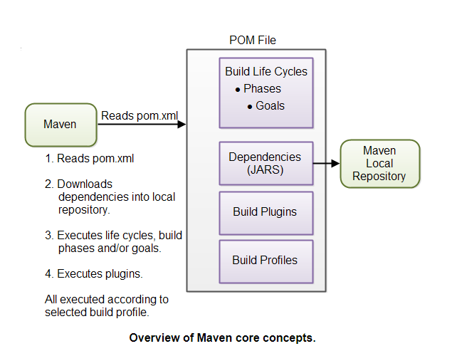
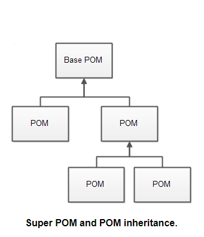

# MAVEN 

### 一、相关信息

#### 1. [maven 官网]([http://maven.apache.org](http://maven.apache.org/))

>**Maven** is a powerful build tool for Java software projects. Actually, you can build software projects using other languages too, but Maven is developed in Java, and is thus historically used more for Java projects.
>
>typical features of build tool :
>
>- Generating source code (if auto-generated code is used in the project).
>- Generating documentation from the source code.
>- Compiling source code.
>- Packaging compiled code into JAR files or ZIP files.
>- Installing the packaged code on a server, in a repository or somewhere else.

#### 2. maven 安装

* 设置java路径，JAVA_HOME,CLASSPATH,Path
* 设置M2_HOME(maven所在目录路径)
* 将%M2_HOME%\bin放入环境变量Path
* echo %PATH%，刷新环境变量
* 运行 mvn -version

#### 3.maven结构

Maven以POM文件（项目对象模型）的概念为中心。 POM文件是项目资源的XML形式表示，如源代码，测试代码，依赖项（使用的外部JAR）等.POM包含对所有这些资源的引用。 POM文件应位于其所属项目的根目录中。



POM文件
执行Maven命令时，为Maven提供一个POM文件来执行命令。然后，Maven将对POM中描述的资源执行命令。

生命周期，阶段和目标
Maven中的构建过程分为构建生命周期，阶段和目标。构建生命周期由一系列构建阶段组成，每个构建阶段由一系列目标组成。当您运行Maven时，您将命令传递给Maven。此命令是构建生命周期，阶段或目标的名称。如果请求执行生命周期，则执行该生命周期中的所有构建阶段。如果请求执行构建阶段，则也会执行在预定义的构建阶段序列中的所有构建阶段。

依赖关系和存储库
Maven执行的第一个目标之一是检查项目所需的依赖项。依赖项是项目使用的外部JAR文件（Java库）。如果在本地Maven存储库中找不到依赖项，Maven会从中央Maven存储库下载它们并将它们放在本地存储库中。本地存储库只是计算机硬盘上的一个目录。如果您愿意，可以指定本地存储库的位置。您还可以指定用于下载依赖项的远程存储库。所有这些将在本教程后面更详细地解释。

构建插件
构建插件用于将额外目标插入构建阶段。如果您需要为标准Maven构建阶段和目标未涵盖的项目执行一组操作，则可以向POM文件添加插件。 Maven有一些你可以使用的标准插件，如果需要，你也可以在Java中实现自己的插件。

构建配置文件
如果需要以不同方式构建项目，则使用构建配置文件。例如，您可能需要为本地计算机构建项目，以进行开发和测试。您可能需要构建它以在生产环境中进行部署。这两个版本可能不同。要启用不同的构建，您可以向POM文件添加不同的构建配置文件。执行Maven时，您可以确定要使用的构建配置文件。

#### POM文件作用

Maven的POM文件描述了项目的资源，包括源码、测试代码的位置，以及有哪些外部依赖。

POM文件描述的是构建Maven仓库的内容，而不是如何构建，如何构建仓库是Maven命令的事。

每个项目都有POM文件，POM.xml ，必须放在项目根目录。如果项目分成多个子项目，一般来说会有一个POM文件作在父项目，每个子项目都有一个POM文件，这种结构允许父项目与子项目分离。

POM文件最小组成：

><project xmlns="http://maven.apache.org/POM/4.0.0"
>xmlns:xsi="http://www.w3.org/2001/XMLSchema-instance"
>xsi:schemaLocation="http://maven.apache.org/POM/4.0.0
>       http://maven.apache.org/xsd/maven-4.0.0.xsd">    
>
>​    <modelVersion>4.0.0</modelVersion>  
>
>​    <groupId>com.jenkov</groupId>
>​    <artifactId>java-web-crawler</artifactId>
>​    <version>1.0.0</version>
></project> 

**modelVersion**:POM模型版本

**groupId**:组织或者项目的唯一ID，不一定要使用java项目包名的形式(以.分割)。

**artifactId**:包含了需要构建仓库的java项目名称

**versionId**:项目版本号

`groupId`, `artifactId` and `version` 这三个元素将会在体现在maven项目打包结果的路径上，路径和包名

> ```
> MAVEN_REPO/com/jenkov/java-web-crawler/1.0.0/java-web-crawler-1.0.0.jar
> ```

每个POM文件都是继承自一个父文件，如果没有特别指明，就继承自 基础POM文件



> ```
> <project xmlns="http://maven.apache.org/POM/4.0.0"
>          xmlns:xsi="http://www.w3.org/2001/XMLSchema-instance"
>          xsi:schemaLocation="http://maven.apache.org/POM/4.0.0
>                       http://maven.apache.org/xsd/maven-4.0.0.xsd">
>     <modelVersion>4.0.0</modelVersion>
>     
>         <parent>
>         <groupId>org.codehaus.mojo</groupId>
>         <artifactId>my-parent</artifactId>
>         <version>2.0</version>
>         <relativePath>../my-parent</relativePath>
>         </parent>
>     
> 
>     <artifactId>my-project</artifactId>
>     ...
> </project>
> ```

查看POM文件整体结构 *effective POM* ：

> ```
> mvn help:effective-pom
> ```

#### Maven 配置文件

Maven有两个配置文件，通过这些配置文件可以跨过所有的POM文件配置Maven相关设置，包括：

> * 本地仓库的位置
> * 活动构建配置文件

这类配置文件叫做settings.xml ，位置：

> - The Maven installation directory: `$M2_HOME/conf/settings.xml`
> - The user's home directory: `${user.home}/.m2/settings.xml`

#### 运行maven

当maven配置好，根目录有POM文件买就可以运行maven命令，可以在mvn命令后面跟 **build life cycle**，**prase**，**goal**

运行build prase

> mvn install
>
> 或
>
> mvn clean install

运行 maven goal

> 
> mvn dependency:copy-dependencies
>

#### maven 目录架构

标准目录架构

| First Header | Second Header |
| ------------ | ------------- |
| src/main/java | Application/Library sources|
| src/main/resources	|Application/Library resources|
| src/main/filters	|Resource filter files|
| src/main/webapp|	Web application sources|
| src/test/java	|Test sources|
| src/test/resources|	Test resources|
| src/test/filters|	Test resource filter files|
| src/it|	Integration Tests (primarily for plugins)|
| src/assembly	|Assembly descriptors|
| src/site	|Site|
| LICENSE.txt	|Project's license|
| NOTICE.txt	|Notices and attributions required by libraries that the project depends on|
| README.txt	|Project's readme|
最重要的部分
``` 
- src
  - main
    - java
    - resources
    - webapp
  - test
    - java
    - resources

- target
```

#### 项目依赖

除非您的项目很小，否则您的项目可能需要外部Java API或框架，这些Java API或框架打包在他们自己的JAR文件中。 编译项目代码时，类路径上需要这些JAR文件。

使用这些外部JAR文件的正确版本使项目保持最新可能是一项全面的任务。 每个外部JAR可能还需要其他外部JAR文件等。递归下载所有这些外部依赖项（JAR文件）并确保下载正确的版本是麻烦的。 特别是当您的项目变得越来越大，并且您获得越来越多的外部依赖项。

幸运的是，Maven内置了依赖管理。 您在POM文件中指定项目所依赖的外部库，以及哪个版本，然后Maven为您下载它们并将它们放在您的本地Maven存储库中。 如果这些外部库中的任何一个需要其他库，那么这些其他库也会下载到您的本地Maven存储库中。

POM配置项目依赖：

```
<project xmlns="http://maven.apache.org/POM/4.0.0"
         xmlns:xsi="http://www.w3.org/2001/XMLSchema-instance"
         xsi:schemaLocation="http://maven.apache.org/POM/4.0.0
   http://maven.apache.org/xsd/maven-4.0.0.xsd">
    <modelVersion>4.0.0</modelVersion>

    <groupId>com.jenkov.crawler</groupId>
    <artifactId>java-web-crawler</artifactId>
    <version>1.0.0</version>
    
      <dependencies>

        <dependency>
          <groupId>org.jsoup</groupId>
          <artifactId>jsoup</artifactId>
          <version>1.7.1</version>
        </dependency>

        <dependency>
          <groupId>junit</groupId>
          <artifactId>junit</artifactId>
          <version>4.8.1</version>
          <scope>test</scope>
        </dependency>

      </dependencies>
    

    <build>
    </build>

</project>
```

当Maven执行此POM文件时，将从中央Maven存储库下载这两个依赖项并将其放入本地Maven存储库。 如果已在本地存储库中找到依赖项，则Maven将不会下载它们。 只有缺少依赖项才会将它们下载到本地存储库中。

有时，中央Maven存储库中没有给定的依赖项。 然后，您可以自己下载依赖项并将其放入本地Maven存储库。 请记住将其放入与groupId，artifactId和version匹配的子目录结构中。 用/替换所有点.并将groupId，artifactId和version与/也分开。 然后你有你的子目录结构。就像：

```
MAVEN_REPOSITORY_ROOT/junit/junit/4.8.1
MAVEN_REPOSITORY_ROOT/org/jsoup/jsoup/1.7.1
```

索引非maven项目目录依赖

```
<dependency>
  <groupId>mydependency</groupId>
  <artifactId>mydependency</artifactId>
  <scope>system</scope>
  <version>1.0</version>
  <systemPath>${basedir}\war\WEB-INF\lib\mydependency.jar</systemPath>
</dependency>
```