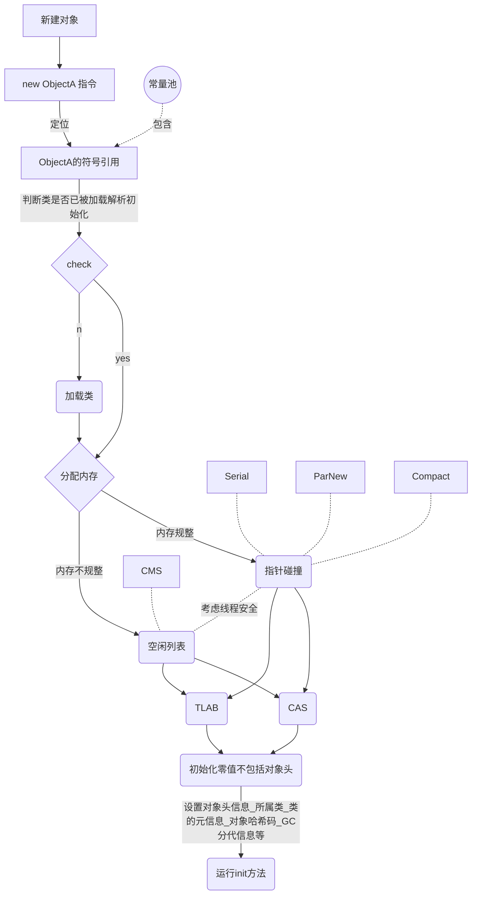

# java内存区域

### java内存模型

​     虽然不像c，c++，那样程序员需要自己new和free内存，jvm的自动内存管理机制解放了程序员的双手。但其实这是把双刃剑，在不知道底层如何使用内存的情况下，出现内存溢出和内存泄漏的情况往往让人无计可施。只有了解虚拟机是如何管理内存的，能在程序出异常的情况下快速定位bug，以及在写代码的情况下尽量避免此类异常。

___

### 运行时数据区

java虚拟机的多线程是通过线程轮流切换并分配处理器执行时间的方式来实现的，在任何一个却定的时刻，一个处理器都只会执行一条线程中的指令。为了线程切换后能恢复到城阙的执行位置，每条线程都需要独立的程序计数器，各条线程之间计数器互不影响，独立存储，这类内存区域为“线程私有”内存。所有线程私有区域的生命周期和线程相同

| 线程共有区域 | 线程私有区域 |
| :------------: | :-------------: |
| 方法区 | 虚拟机栈 |
| 堆 | 本地方法栈 |
|   | 程序计数器 |

**程序计数器** ：当前县城所执行字节码的行号指示器。在虚拟机的概念模型里，字节码解释器通过改变这个技术其的值来选取线一条执行的字节码指令，完成分支、循环、跳转、异常处理、线程恢复等。执行java方法时，这个计数器记录的时虚拟机字节码指令地址，执行native方法时，计数器值为空，此区域是Java虚拟机规范中唯一一个没有规定OutOfMemoryError的区域

**Java虚拟机栈** ：描述的是***Java方法执行的内存模型*** ，每个方法在执行的同时都会创建一个栈帧，用于存储**局部变量表**、操作数栈、动态链接、方法出口等信息。每一个方法从调用到执行完成的过程对应这一个栈帧在虚拟机栈中入栈到出栈的过程。**局部变量表** 存放编译期间可知的各种基本数据类型、对象引用(对象指针或者句柄)和returnAddress类型(指向字节码指令地址)。64bit的long和double类型占用2个局部变量表空(Slot)，其余类型占一个，局部变量表所需要的内存空间在编译期间完成分配，当进入一个方法时，这个方法在帧中分配多大的局部变量空间时完全确定的，在方法运行期间不会改变局部变量表大小。线程请求栈深度大于虚拟机所允许的深度，会抛出StackOverflowError 异常；虚拟机动态扩展无法申请到足够内存，会抛出OutOfMemoryError异常。

**本地方法栈** ：与虚拟机方法栈相似，但是为Native方法服务。

**java堆** ：java虚拟机管理的内存中最大的一块，为所有线程共享的一块区域。在虚拟机启动时创建，此内存区唯一的目的就是存放对象实例，几乎所有对象实例都在堆上分配内存。但是随着JIT编译器与逃逸分析技术的发展，在java堆上分配内存变得不是那么绝对。Java堆是垃圾收集器管理的主要区域，也成GC堆。由于垃圾收集器采用分代收集算法，堆可以分为：新生代和老年代或者为Eden 空间，From Survivor空间，To Survivor空间。此外堆中还有**线程私有的分配缓冲区**(Thread Local Allocation Buffer,TLAB)。java堆可以处于物理上不连续的空间，只需要逻辑上连续，其大小可以扩展。过如果在堆中为实例分配内存没有足够的区域，会抛出OutOfMemoryError异常。

**方法区** ： 方法区存储的是已经被虚拟机加载的类信息、常量、静态变量、技术编译后的代码等信息，该区域也称为非堆(Non-Heap)。HotSpot虚拟机中将GC分代收集算法扩展至方法区，或者叫用永久代的方法实现方法区，省区编写内存管理代码的工作，所以有人称这部分区域为”永久代“，但是在其他的虚拟机中不存在永久代的概念。HotSpot也在逐渐放弃永久代并逐渐采用Native Memory 来实现方法区。JDK1.7中，HotSpot已经将字符串常量池从永久代中移除。方法区无法满足内存分配需求时，会抛出OutOfMemoryError异常。

* 运行时常量池：方法区的一部分。Class文件中除了有类的版本、字段、方法、接口等描述信息，还有常量池(Constant Pool Table)，用于存放编译期间生成的各种字面量和符号引用，这部分内容将在类加载后进入方法区的运行时常量池存放。Java虚拟机堆Class文件的每一部分格式都有都有严格规定，符合规定才会被虚拟机认可、装载和执行。但是对于运行时常量池，Java虚拟机规范没有任何要求。运行时常量池中除了保存Class文件中的符号引用还有翻译出来的直接引用。**运行时常量池具有动态特性**，Java语言并不要求常量一定编译期间才能产生，也就是并非预置到Class文件中常量池的内容才能进运行时常量池，运行期间可能有新的常量入池，例如String.intern()方法。运行时常量池是方法区的一部分，无法申请到足够的内存时会抛出OutOfMemoryError异常。

**直接内存** ：直接内存并不是虚拟机运行时数据区的一部分，也不是Java虚拟机规范中定义的内存区域。但是这部分内存频繁使用，也容易倒是OutOfMemoryError异常。JDK1.4中加入了NIO(New Input/Output)类，引入了一种基于通道与缓冲区(Buffer)的I/O方式，它使用Native函数库直接分配堆外内存，然后通过Java堆中的DirectByteBuffer对象作为这块内存的引用进行操作。这样能显著提高性能，避免在Java堆和Native堆来回复制数据，但也容易出现OutOfMemoryError异常。 

____

### 对象创建、布局、访问

**对象创建过程** ：

**对象内存布局** ：包含三块区域，对象头，实例数据，对齐填充